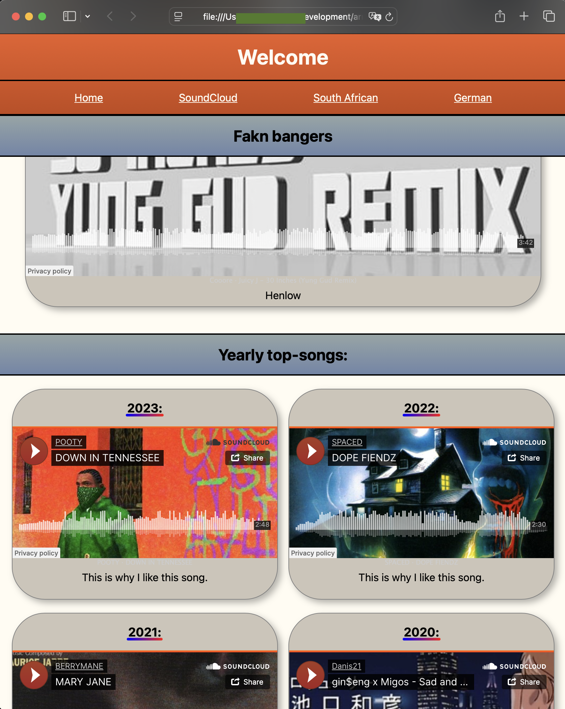

# Music Catalogue

> TLDR: I made this website to show you SoundCloud & Spotify tracks that I think are tight.

## About

This project showcases my journey learning HTML and CSS fundamentals. 

## Features

- **Curated Selection** - Handpicked tracks from SoundCloud and Spotify
- **Clean Interface** - Minimalist design focused on the music
- **Direct Links** - Easy access to tracks on their original platforms

## Tech Stack

- **HTML5** - Semantic markup and structure
- **CSS3** - Custom styling and responsive layout
- **Vercel** - Fast and reliable hosting

## Live Demo

Check out the live site: [Music Catalogue](URL_HERE)

## Contributing

Found a track that belongs in this collection? Feel free to open an issue with your suggestion!
